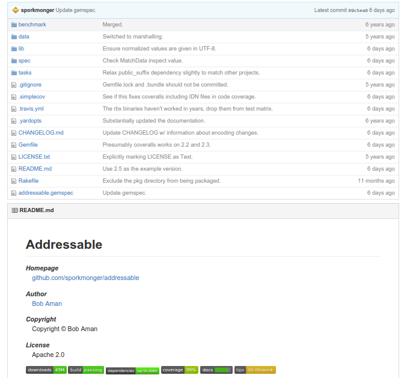

# Гемы, что они такое, как их выбирать и создавать

**Kottans-Ruby**, осень 2016

Лекция **Четвёртая** (не считая мастер-класса)

**Виктор Шепелев** (zverok)

## Что такое гем

* Полезный код
* ...инкапсулирующий что-то важное
  * сложные данные;
  * сервисы и хранилища;
  * специфические концепции и операции;
* ...оттестированный, документированный и проверенный в бою;
* ...выложенный на rubygems.orgне обязательно.

## Как выглядит хороший гем

## Эй, а почему это важно?

1. **Любой код хочет стать гемом** (А вы хотите стать профессионалами)
2. Понимать, чем хороший гем отличается от плохого — важно.

## Гем — это не просто кусок кода

Это ещё:

* тесты;
* документация;
* примеры;
* обобщения и конфигурабельность;
* чёткое разделение ответственности.


Кстати, _обычному коду_ это всё тоже не помешает!



Вот почему эта лекция важна


## Ответственность: библиотеки vs фреймворки vs утилиты

* Библиотека: подключаем и используем (например, addressable);
* Фреймворк: подключаем и выстравиваем код определённым образом (например, rails);
* Утилита: запускаем в командной строке (например, rubocop).

## Ответственность: независимые гемы vs плагины

* Пример независимого гема: addressable;
* Пример плагина: rspec-rails.

## Чтобы просто код превратился в гем...

...нужно добавить — что?

* сначала нужно _убрать_:
  * все лишние ожидания касательно среды, окружающих библиотек, версий и проч.;
  * любые следы кода, который делает вещи, не относящиеся к гему;
* сделать конфигурации и обобщения;
  * или явный выбор в пользу convention over configuration (_и гореть в аду_);
* примеры;
* доки.

## Доки

* README;
* YARD/RDoc;
* GitHub Wiki и другие туториалы.

## Инструменты контроля качества

* **тесты**но их недостаточно
* качество кода: `rubocop` (`reek`, `flog` и другие);
* качество кода: CodeClimate;
* автоматизированная проверка: continuous integration — TravisCI;
* ....

## Инструменты контроля качества: беджики

## Последний шаг: публикация гема

* `gem build && gem push`;
* rubyflow.com (кстати, его надо читать);
* reddit.com/r/ruby (кстати, его надо читать).

## Домашняя работа

README-driven development:
* берём тестов несуществующего зверя, написанные в прошлом уроке;
* пишем заготовку _хорошего_ ридми гема, который содержит этого зверя и позволяет его использовать;
* ориентируемся на популярные современные библиотеки.

## Итого

* Гем — это профессиональная стадия жизни кода;
* Пишите свой код так, как будто он станет популярным гемом, однажды;
* Все инструменты и подходы разработчика гемов обычному разработчику тоже пригодятся!

# Hey, it is me!

Спасибо. С вами был **Виктор Шепелев**, обычно в интернетах известный как **zverok**.

* Мой гитхаб: https://github.com/zverok (и организация https://github.com/molybdenum-99 для
  самых интересных штук);
* Личный сайт (как разработчика): https://zverok.github.io;
* Мой профайл (платного) Ruby-ментора: https://mkdev.me/mentors/zverok.

# Now, let's talk

Хорошие вопросы:

* карьера и самообразование;
* опыт и истории из жизни;
* в чём проблемы Рельсов;
* куда движется Руби;
* опенсорс, как и зачем.

Плохие вопросы:

* доктор, а почему когда я делаю _так_, в коленке хрустит? (конкретные вопросы применения специфических библиотек);
* политика, секс, диетология, йога.
